# Домашнее задание к занятию 5. «Практическое применение Docker»

Проверила, что старая версия docker-compose (v1) не установлена. Когда попыталась выполнить команду docker-compose --version, система выдала ошибку, что команда не найдена. Установлена актуальная версия docker compose (v2.37.1).
Это говорит о том, что окружение настроено правильно.

(скрин докер нот фаунд)


## Задание 1

выполнила fork репозитория shvirtd-example-python в личный GitHub
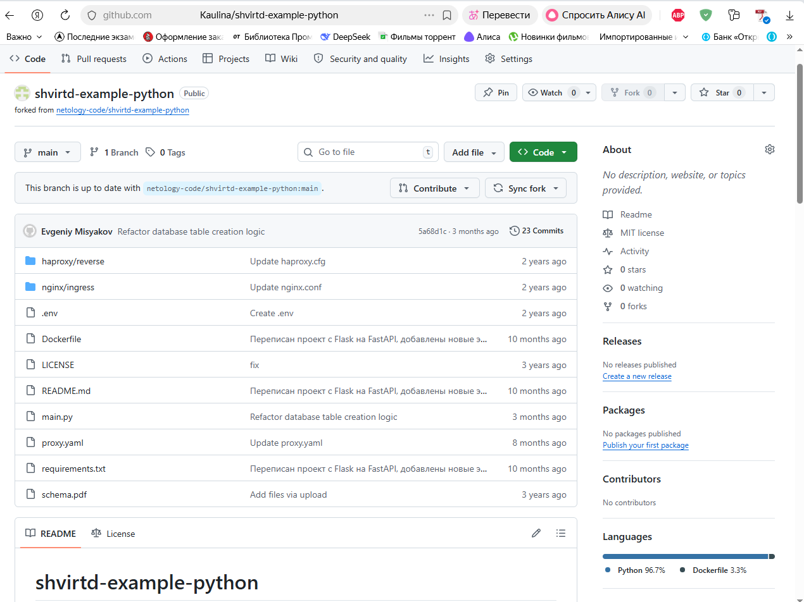

склонировала репозиторий на ВМ (локально)


Я сделала Dockerfile с multistage сборкой. За основу взяла образ python:3.12-slim. На этапе сборки устанавливаются все зависимости, которые потом переносятся в итоговый образ. Запуск приложения происходит через uvicorn.


Создала файл .dockerignore, который исключает лишние файлы и папки — например, служебные файлы Git, кэш Python, файлы окружения и базы данных. Это помогает снизить размер Docker-образа и ускорить его сборку.


Выполнила сборку Docker-образа на основе созданного Dockerfile с использованием multistage  сборки

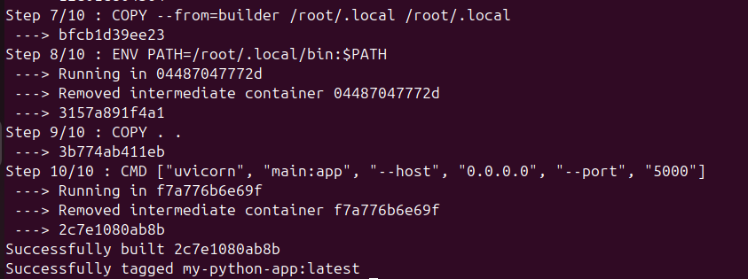

Docker-образ собрался и запустился без проблем. Приложение стартует нормально, но при попытке подключиться к базе данных MySQL появляется ошибка, потому что сама база данных не запущена. Это показывает, что приложение работает правильно, а для полноценной работы нужно настроить окружение через docker compose.


## Задание 2

установила Yandex Cloud CLI (yc)


я выполнила авторизацию YC и выполнила настройки:

```dockerfile
irina@ubuntuVB:~$ yc init
Welcome! This command will take you through the configuration process.
Pick desired action:
 [1] Re-initialize this profile 'default' with new settings 
 [2] Create a new profile
Please enter your numeric choice: 1
Please go to https://oauth.yandex.ru/authorize?response_type=token&client_id=1a6990aa636648e9b2ef855fa7bec2fb in order to obtain OAuth token.
 Please enter OAuth token: [y0__xDmrsjFAh***************************SfDWwgpcEDSgA] 
You have one cloud available: 'cloud-kostochkina-a' (id = b1g94ecfq1al18t5jd43). It is going to be used by default.
Please choose folder to use:
 [1] default (id = b1grv7g6v3d86hdtr30s)
 [2] Create a new folder
Please enter your numeric choice: 1
Your current folder has been set to 'default' (id = b1grv7g6v3d86hdtr30s).
Do you want to configure a default Compute zone? [Y/n] y
Which zone do you want to use as a profile default?
 [1] ru-central1-a
 [2] ru-central1-b
 [3] ru-central1-d
 [4] ru-central1-e
 [5] ru-central1-k
 [6] Don't set default zone
Please enter your numeric choice: 1
Your profile default Compute zone has been set to 'ru-central1-a'.

```

далее выполнила тегирование локального docker, загрузила его в облако и запустила
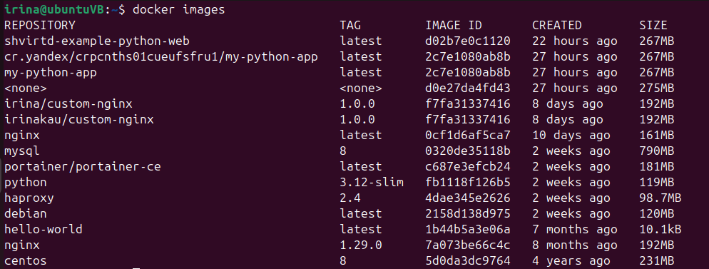

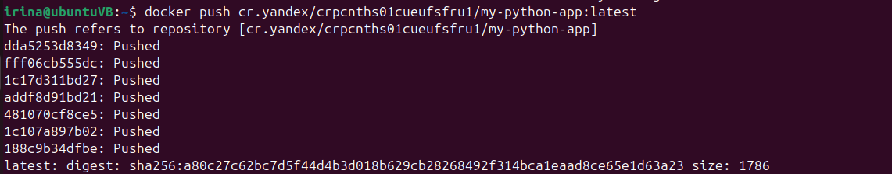

 В ходе сканирования нашли уязвимости разного уровня — high, medium и low — что вполне ожидаемо для базовых образов.

 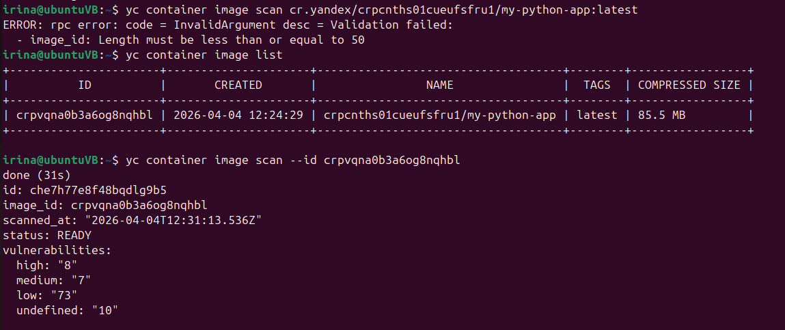

## Задание 3

Создала файл compose.yaml, в котором описаны сервисы web и db, а также подключён proxy.yaml с помощью директивы include. Настроила пользовательскую bridge-сеть с фиксированными IP-адресами. Параметры конфигурации заданы через файл .env.

Проект запустился с помощью Docker Compose. Все сервисы — nginx, haproxy, web и mysql — работают без сбоев. Проверка через curl показала, что приложение отвечает, что говорит о том, что все сервисы связались и работают правильно.

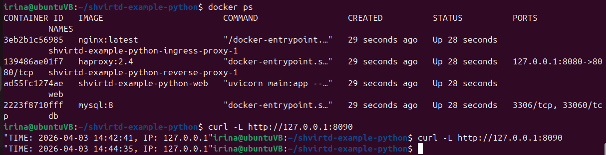

```dockerfile
irina@ubuntuVB:~/shvirtd-example-python$ docker exec -it db mysql -uroot -p
Enter password: 
Welcome to the MySQL monitor.  Commands end with ; or \g.
Your MySQL connection id is 14
Server version: 8.4.8 MySQL Community Server - GPL

Copyright (c) 2000, 2026, Oracle and/or its affiliates.

Oracle is a registered trademark of Oracle Corporation and/or its
affiliates. Other names may be trademarks of their respective
owners.

Type 'help;' or '\h' for help. Type '\c' to clear the current input statement.

mysql> show databases;
+--------------------+
| Database           |
+--------------------+
| information_schema |
| mysql              |
| performance_schema |
| sys                |
| virtd              |
+--------------------+
5 rows in set (0.02 sec)

mysql> use virtd;
Reading table information for completion of table and column names
You can turn off this feature to get a quicker startup with -A

Database changed
mysql> show tables;
+-----------------+
| Tables_in_virtd |
+-----------------+
| requests        |
+-----------------+
1 row in set (0.01 sec)

mysql> SELECT * from requests LIMIT 10;
+----+---------------------+------------+
| id | request_date        | request_ip |
+----+---------------------+------------+
|  1 | 2026-04-03 14:42:41 | 127.0.0.1  |
|  2 | 2026-04-03 14:44:35 | 127.0.0.1  |
+----+---------------------+------------+
2 rows in set (0.00 sec)

mysql> 

```

## Задача 4

мной была создана ВМ в YC, и поставила docker с помощью команды

ssh ubuntu@178.154.221.131

irina@ubuntuVB:~$ docker --version
Docker version 28.2.2, build 28.2.2-0ubuntu1~24.04.1

т.к. паект docker compose v2 отсутствовал, я установила его вручную.

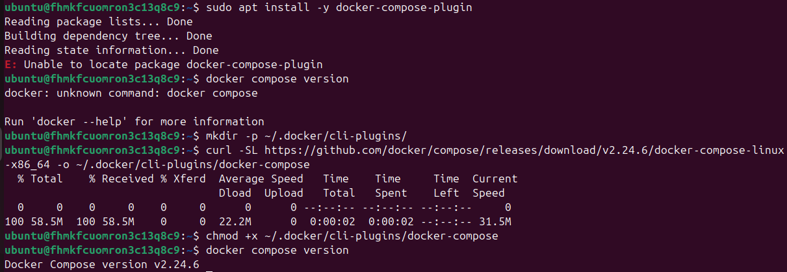

Запустила сервис, который включает FastAPI-приложение и базу данных MySQL.

Проверила, что приложение доступно по внешнему IP и порту 8090. Запросы успешно проходят через контейнер и доходят до приложения.

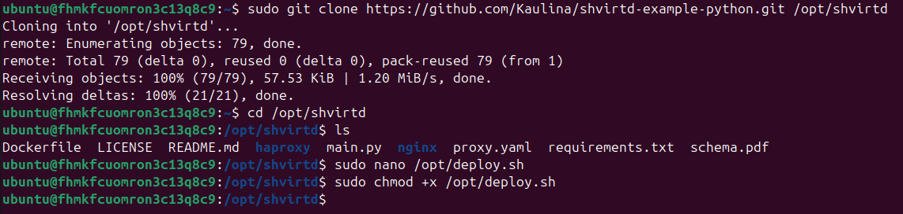

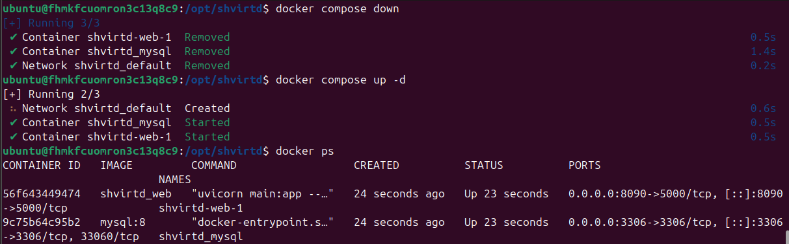

Также проверила доступность сервиса с внешней сети с помощью сервиса check-host.net.

Отдельно проверила подключение к базе данных, выполнив SQL-запрос SELECT NOW().

В процессе обнаружила и исправила ошибку подключения к базе — вместо имени контейнера в Docker-сети использовался адрес 127.0.0.1.

Итоговое решение:

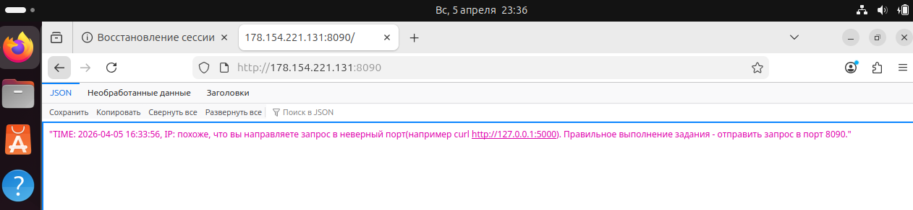

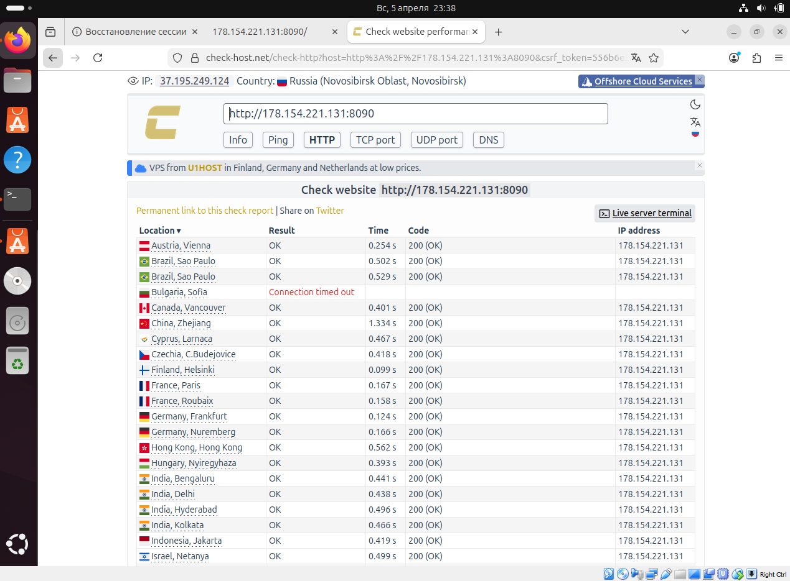

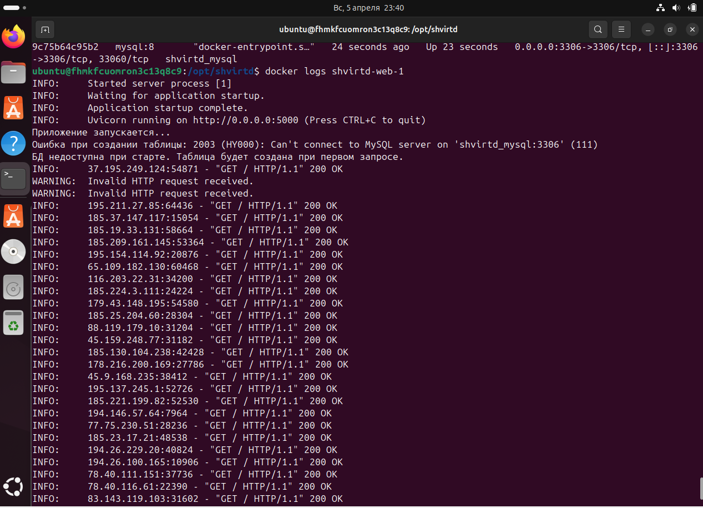

Все сервисы — nginx, haproxy, web и база данных — запустились. Приложение доступно по http через внешний ip и правильно обрабатывает запросы.

## Задача 5

Сначла создала папку backup

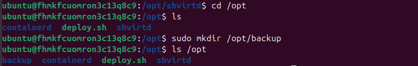

бэкап создался

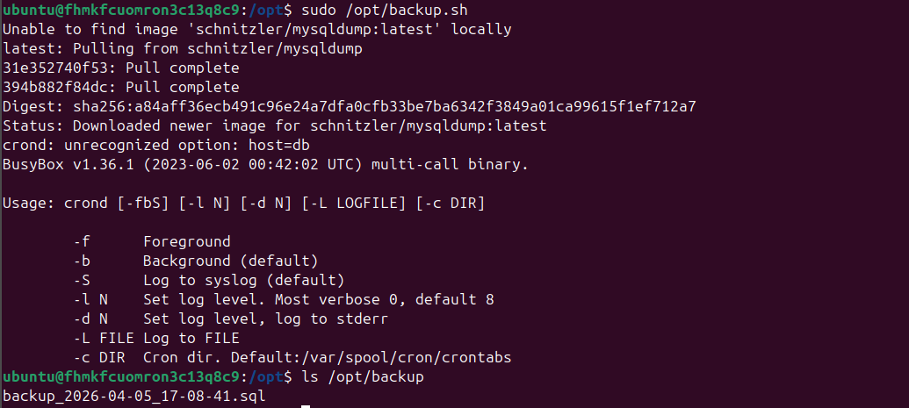

cron

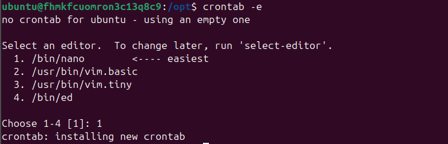

Настроила механизм резервного копирования базы данных MySQL с помощью контейнера schnitzler/mysqldump. Копии сохраняются в папку /opt/backup. Скрипт запускается автоматически каждую минуту через cron.

```dockerfile
* * * * * /opt/backup.sh
```

 Логины и пароли не прописаны в коде, а берутся из файла .env.

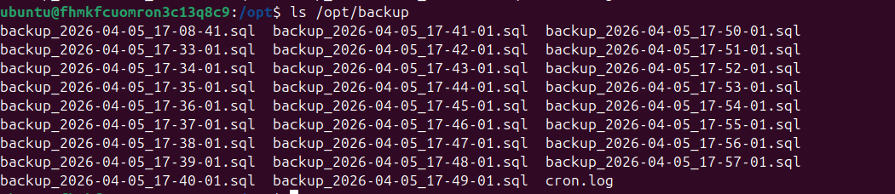

## Задача 6

Извлекла terraform из docker-образа

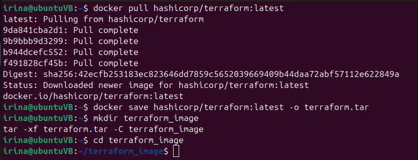

файл запущен локально

Из-за того, что использовала OCI-формат образа, слои взялись из папки blobs, где лежал бинарник terraform, который удалось достать и запустить.

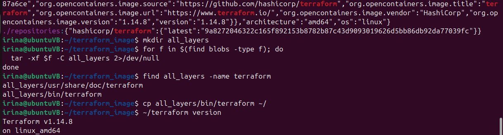

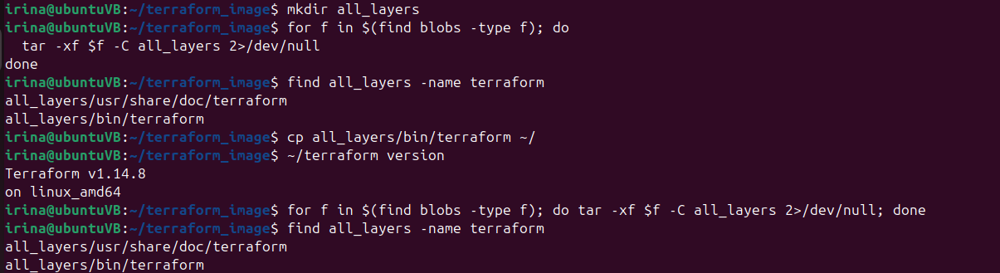

### Задача 6.1

запустила контейнер через docker cp

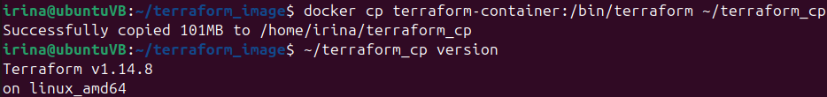

этот способ более простой, и не требует распаковки образа.

### Задача 6.2

извлекла terraform с помощью docker build
в процессе скопировала его в корень контейнера, и извлекла docker cp

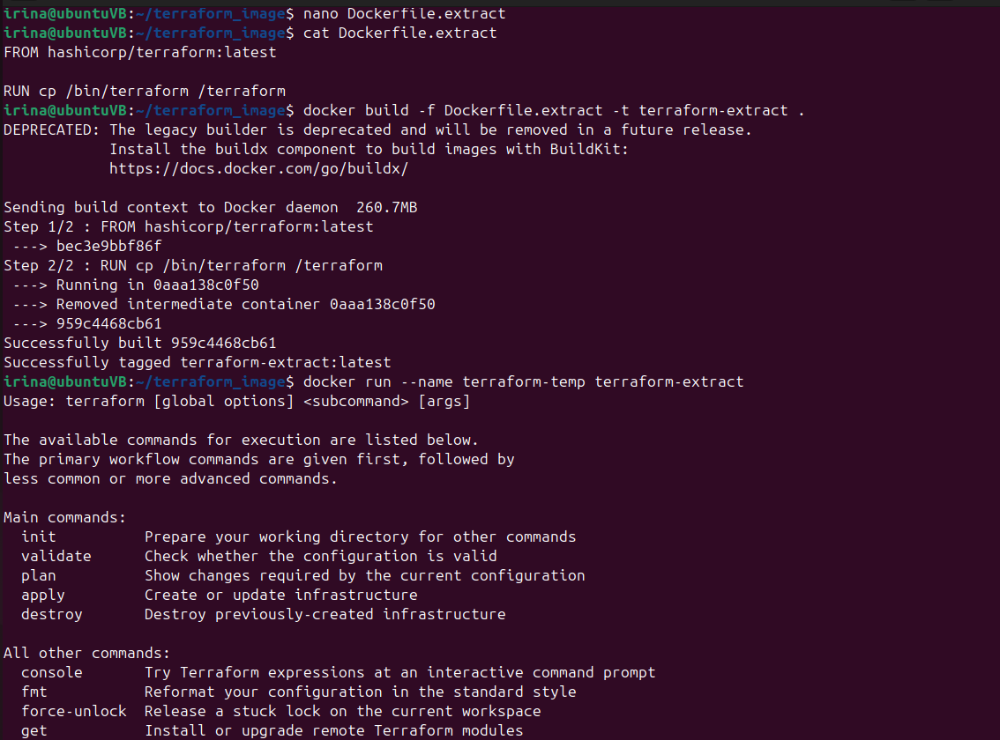

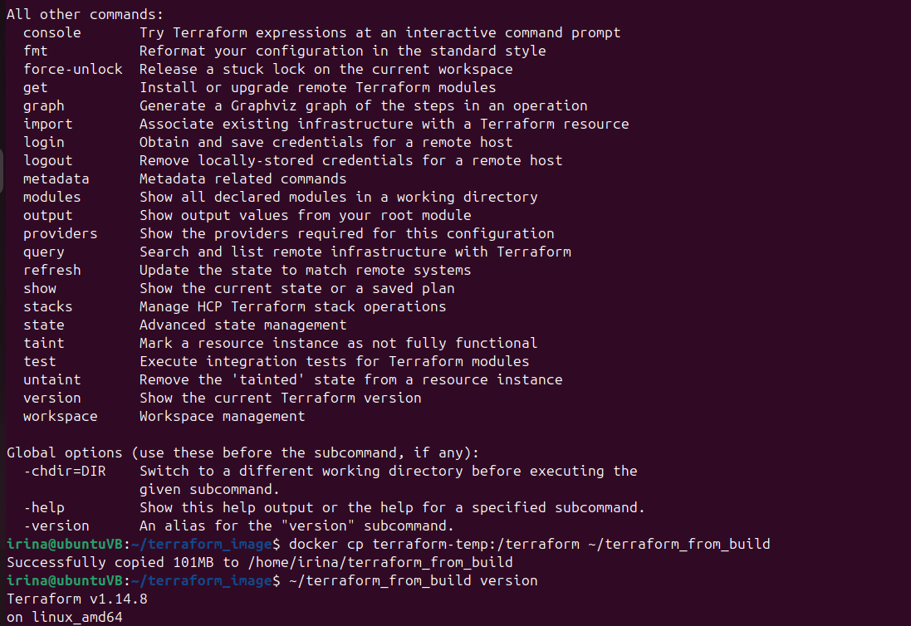

запустила контейнер

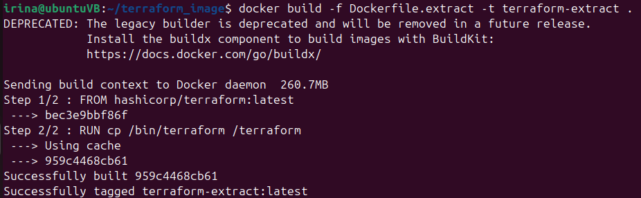

все работает

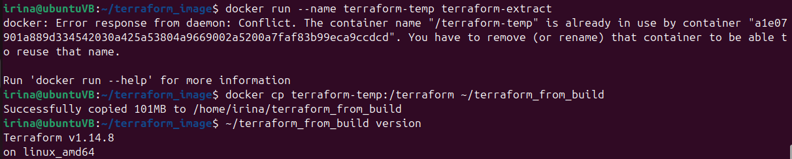

## Задача 7

