# Домашнее задание к занятию «Введение в Terraform»

## Задание 1

при установке terraform столкнулась с проблемой,  terraform не смог получить список провайдеров из registry, произошла сетевая блокировка. 
что видно на скрине

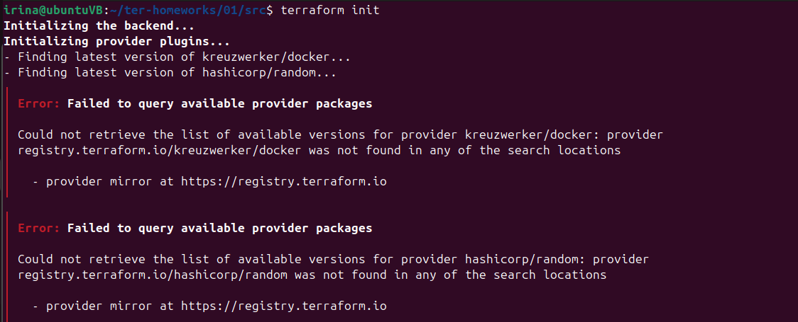

я создала ВМ на YC

здесь я тоже столкнулась с рядом проблем, что в итоге привело к тому, что было включено пользовательское переопределение terraform registry.

вторая проблема, когда HashiCorp registry зарезал доступ по ip. 
terraform registry открывался, но API возвращался HTML вместо JSON

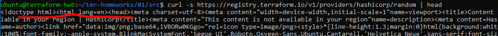

после удаления .terraformrc всё заработало

rm -rf .terraform .terraform.lock.hcl

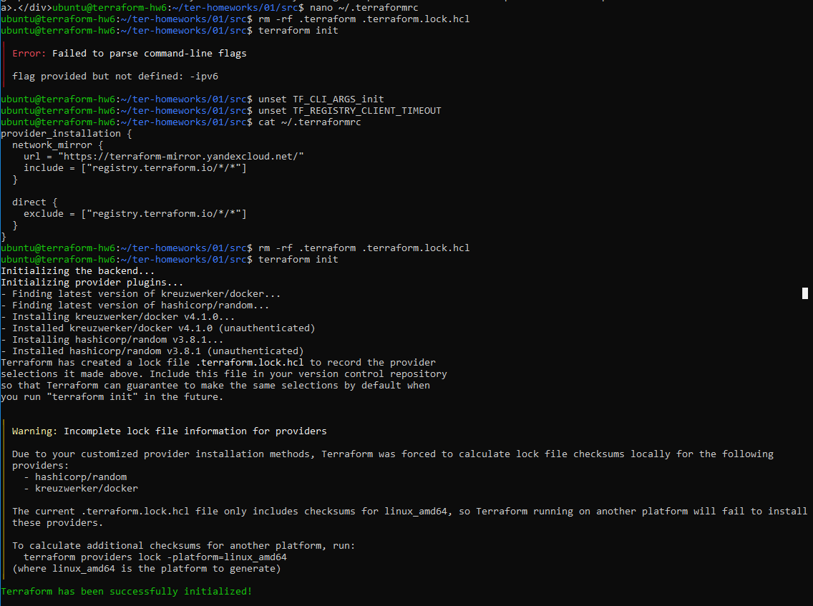

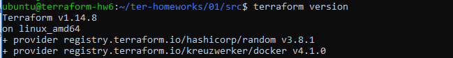

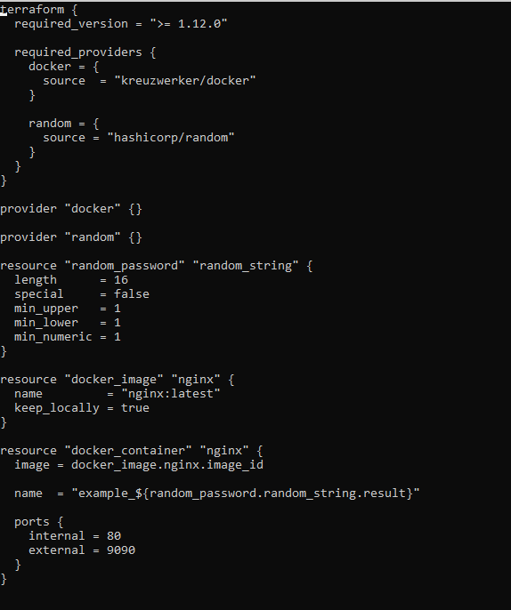

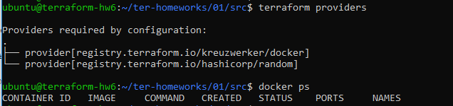

пока выполняла задание, поняла что с VSCode будет проще работать. Настроила :-)

выполнила terraform apply, и проверила nginx в браузере

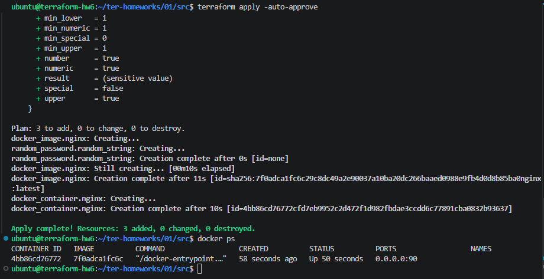

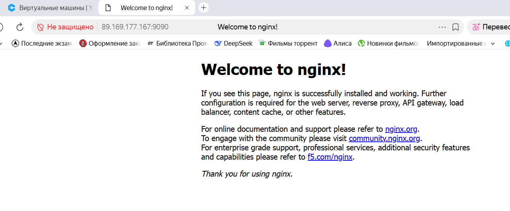

сделала замену имени docker-контейнера в блоке кода на hello_world

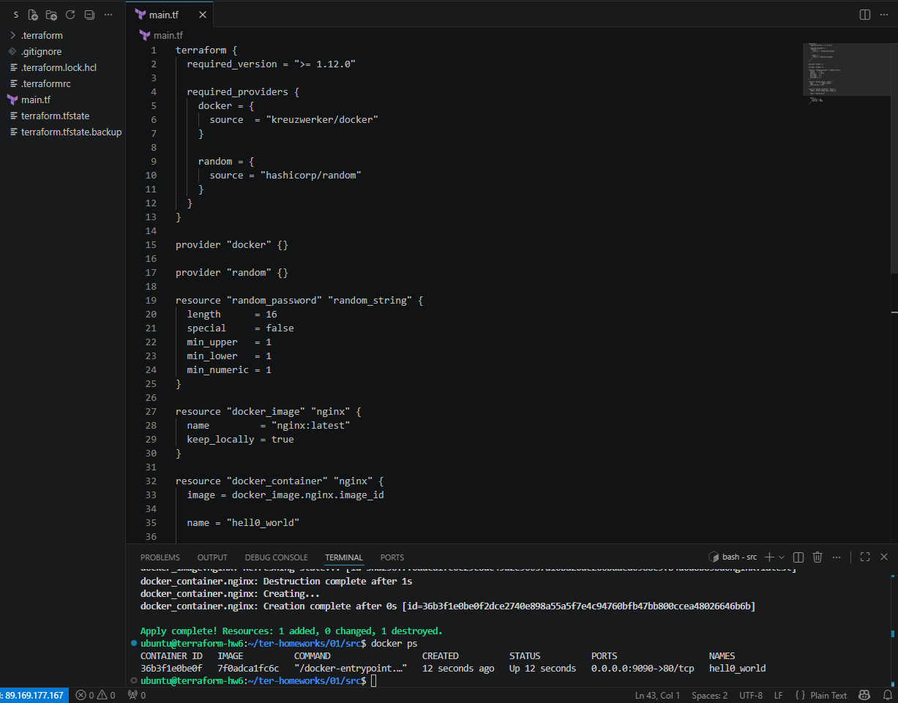

в чем подвох с ключом -auto-approve

этот ключ просто убирает надобность вручную подтверждать изменения.
обычно, если его не использовать, terraform обязательно спросит:
Do you want to perform these actions? yes/no
а вот с ним он сразу же все выполняет.

опасность в том, что можно случайно удалить какую-то часть инфраструктуры.
есть риск применить настройки, которые оказались неверными.
и главное, перед запуском не будет никакой финальной проверки.

но его часто используют, когда нужно все автоматизировать, например, в системах CI/CD.
пригождается он и для скриптов.
удобно применять его в тестовых средах.

удалила созданные ресурсы с помощью terraform

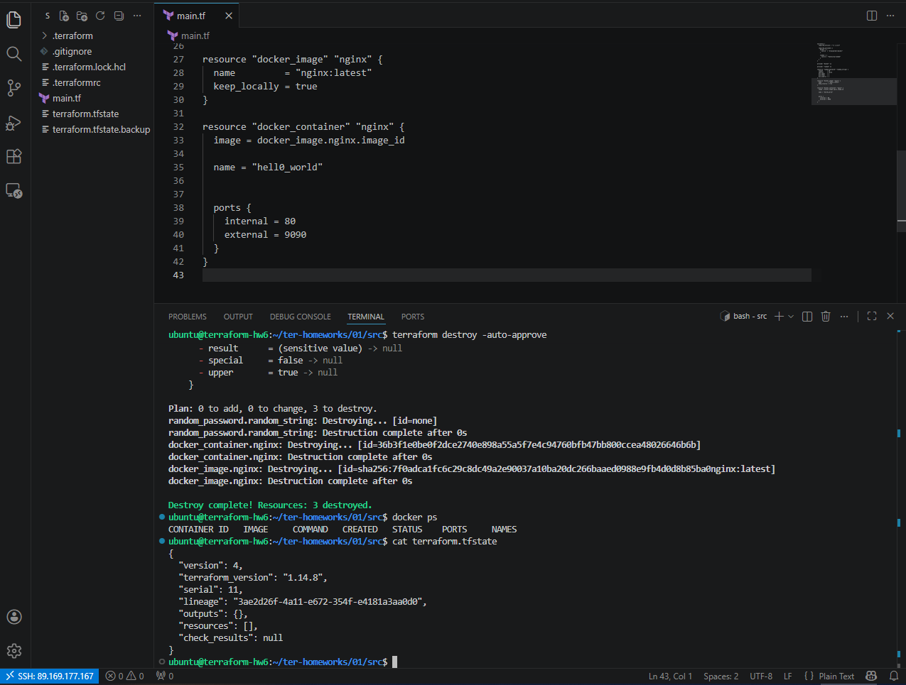

как видно из скрина, удалился контейнер, но образ остался, т.к. в main.tf есть строка:
keep_locally = true

из документации terraform провайдера docker:
If true, then the Docker image won't be deleted on destroy.

## Задание 2

на основе предудыщего задания уже готово:
Terraform установлен
провайдеры работают
nginx контейнер создан
random_password создан

далее выполнила:
secret найден в state
docker ps проверен
validate пройден

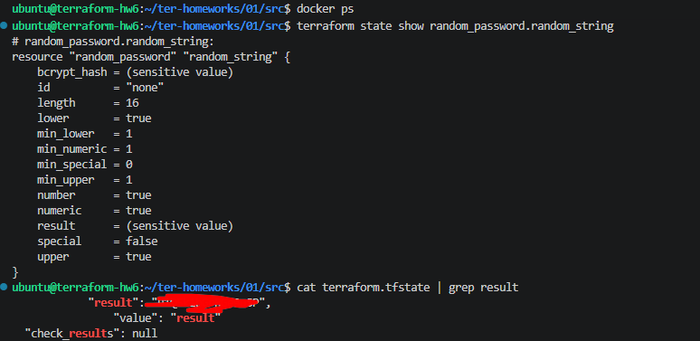

внесла изменения в файл main.tf

```dockerfile
terraform {
  required_version = ">= 1.12.0"

  required_providers {
    docker = {
      source  = "kreuzwerker/docker"
    }

    random = {
      source = "hashicorp/random"
    }
  }
}

provider "docker" {}

provider "random" {}

resource "random_password" "random_string" {
  length      = 16
  special     = false
  min_upper   = 1
  min_lower   = 1
  min_numeric = 1
}


resource "docker_container" "mysql" {
  image = "mysql:8"

  name = "hello_world"

  ports {
    internal = 3306
    external = 3306
    ip       = "127.0.0.1"
  }

  env = [
    "MYSQL_ROOT_PASSWORD=${random_password.random_string.result}",
    "MYSQL_DATABASE=wordpress",
    "MYSQL_USER=wordpress",
    "MYSQL_PASSWORD=${random_password.random_string.result}",
    "MYSQL_ROOT_HOST=%"
  ]
}

```

после выполнения запроса, docker-контейнер MySQL запущен, порт проброшен, старт успешный 

миграция сделанная rettaform выполнена корректно

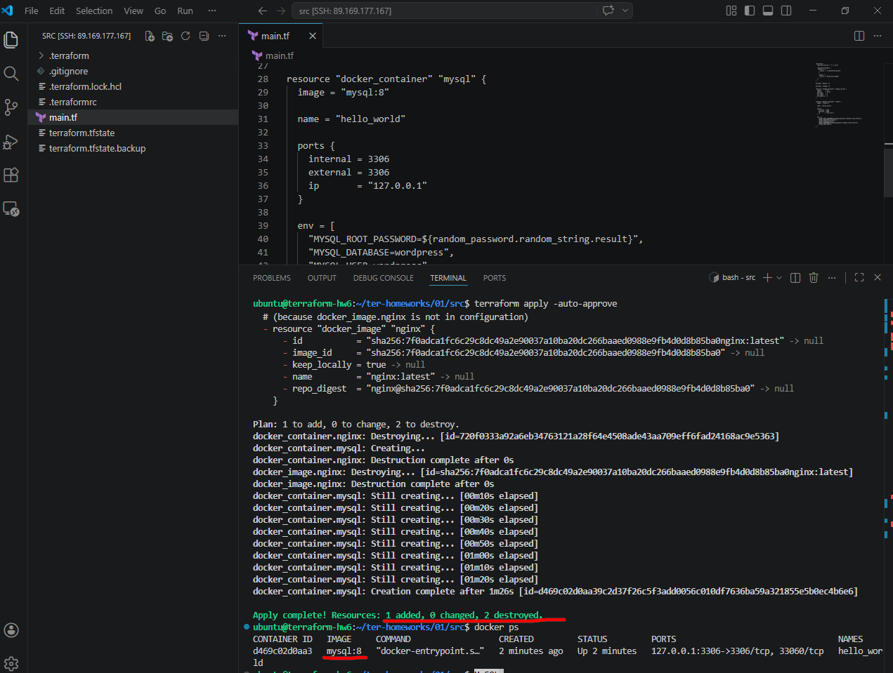

проверка:

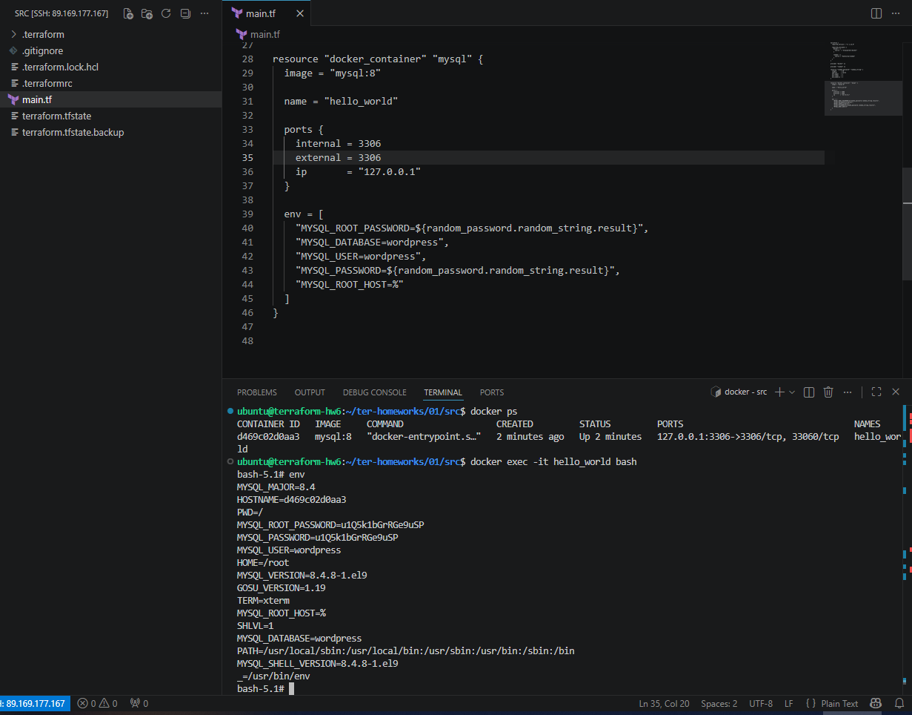
