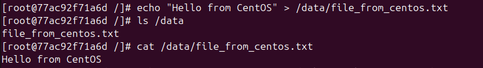

# Домашнее задание к занятию 4 «Оркестрация группой Docker контейнеров на примере Docker Compose»

## Задача 1

FROM nginx:1.29.0
COPY index.html /usr/share/nginx/html/index.html

файл index.html содержит следующее:

<html>
<head>
Hey, Netology
</head>
<body>
```<h1>I will be DevOps Engineer!</h1>```
</body>
</html>


Сборка образа -docker build -t irina/custom-nginx:1.0.0 .
Ретег образа, т.к. имеется разница в никнейме - docker tag irina/custom-nginx:1.0.0 irinakau/custom-nginx:1.0.0
Публикация - docker push irinakau/custom-nginx:1.0.0
Ссылка на DockerHub - https://hub.docker.com/repository/docker/irinakau/custom-nginx/general


## Задача 2

irina@ubuntuVB:~$ date +"%d-%m-%Y %T.%N %Z" ; sleep 0.150 ; docker ps ; ss -tlpn | grep 127.0.0.1:8080 ; docker logs custom-nginx-t2 -n1 ; docker exec -it custom-nginx-t2 base64 /usr/share/nginx/html/index.html
29-03-2026 13:21:07.208775748 +07
CONTAINER ID   IMAGE                         COMMAND                  CREATED         STATUS         PORTS                    NAMES
fae573bedd14   irinakau/custom-nginx:1.0.0   "/docker-entrypoint.…"   2 minutes ago   Up 2 minutes   127.0.0.1:8080->80/tcp   custom-nginx-t2
LISTEN 0      4096       127.0.0.1:8080       0.0.0.0:*          
2026/03/29 06:19:00 [notice] 1#1: start worker process 29
PGh0bWw+CjxoZWFkPgpIZXksIE5ldG9sb2d5CjwvaGVhZD4KPGJvZHk+CjxoMT5JIHdpbGwgYmUg
RGV2T3BzIEVuZ2luZWVyITwvaDE+CjwvYm9keT4KPC9odG1sPgo=

вывод запроса показывает: 
статус Up 2 minutes - контейнер работает
порт 8080 прослушивается
index.html реально внутри контейнера - я получила base64-код страницы
nginx запустился

проверка, что страница реально доступна извне:
irina@ubuntuVB:~$ curl http://127.0.0.1:8080
<html>
<head>
Hey, Netology
</head>
<body>
<h1>I will be DevOps Engineer!</h1>
</body>
</html>

## Задача 3

Контейнер остановился, потому что команда docker attach подключает нас к главному процессу контейнера с PID 1.
В контейнере nginx запущен в режиме foreground -- это и есть основной процесс.
Если нажать Ctrl+C, процесс получает сигнал SIGINT.
Из-за этого основной процесс завершается, и контейнер останавливается вместе с ним.

Когда в контейнере nginx я поменяла порт на 81, доступ к проброшенному на хост порт 8080 перестал работать. Это произошло потому, что проброс портов в Docker связан с портом внутри контейнера (ранее был 80), и после изменения настройки порты больше не совпадают.
root@fae573bedd14:/# curl http://127.0.0.1:80
curl: (7) Failed to connect to 127.0.0.1 port 80 after 2 ms: Couldn't' connect to server
root@fae573bedd14:/# curl http://127.0.0.1:81
<html>
<head>
Hey, Netology
</head>
<body>
<h1>I will be DevOps Engineer!</h1>
</body>
</html>

команда - ss -tlpn | grep 127.0.0.1:8080
показала:
irina@ubuntuVB:~$ ss -tlpn | grep 127.0.0.1:8080

Пустой вывод означает, что порт 8080 на хосте больше не принимает подключения, потому что nginx в контейнере изменил порт с 80 на 81. Это объясняет, почему запрос curl к http://127.0.0.1:8080 снаружи не срабатывает.

## Задача 4

контейнер centos запущен:
irina@ubuntuVB:~/docker-task4$ docker ps
CONTAINER ID   IMAGE      COMMAND               CREATED         STATUS         PORTS     NAMES
77ac92f71a6d   centos:8   "tail -f /dev/null"   7 seconds ago   Up 5 seconds             centos-container

Файл file_from_centos.txt создали в контейнере CentOS, и теперь его можно найти в смонтированном каталоге /data:


[root@77ac92f71a6d /]# echo "Hello from CentOS" > /data/file_from_centos.txt
[root@77ac92f71a6d /]# ls /data
file_from_centos.txt
[root@77ac92f71a6d /]# cat /data/file_from_centos.txt
Hello from CentOS

создадим файл на хосте:
irina@ubuntuVB:~/docker-task4$ echo "Hello from Host" > file_from_host.txt
irina@ubuntuVB:~/docker-task4$ ls
file_from_centos.txt  file_from_host.txt
irina@ubuntuVB:~/docker-task4$ cat file_from_host.txt
Hello from Host

проверим файлы:
irina@ubuntuVB:~/docker-task4$ docker exec -it debian-container bash
root@33c77667f610:/# ls /data
file_from_centos.txt  file_from_host.txt
root@33c77667f610:/# cat /data/file_from_centos.txt
Hello from CentOS
root@33c77667f610:/# cat /data/file_from_host.txt
Hello from Host

## Задача 5
Я создала 2 файла compose.yaml и docker-compose.yaml
compose.yaml – для Portainer
docker-compose.yaml – для локального registry

docker compose up -d - запустил контейнер Portainer

проверила, что контейнер реально раотает и слушает порт.


Portainer установлен и доступен на http://127.0.0.1:9000
Контейнер успешно работает после перезапуска.
