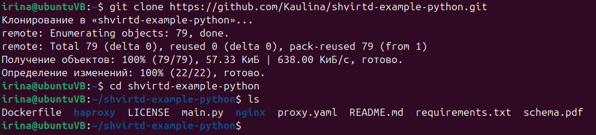
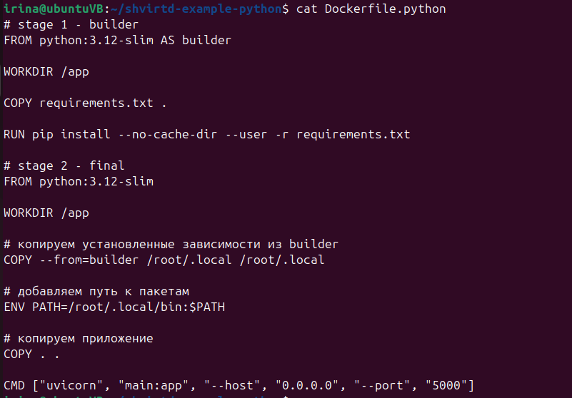
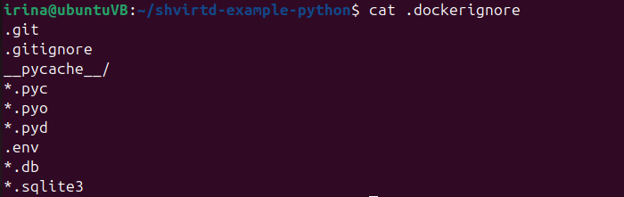
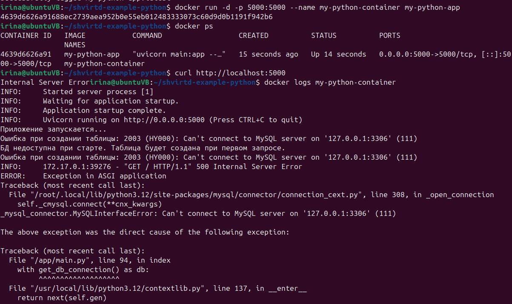

# Домашнее задание к занятию 5. «Практическое применение Docker»

Проверила, что старая версия docker-compose (v1) не установлена. Когда попыталась выполнить команду docker-compose --version, система выдала ошибку, что команда не найдена. Установлена актуальная версия docker compose (v2.37.1).
Это говорит о том, что окружение настроено правильно.

(скрин докер нот фаунд)


## Задание 1

выполнила fork репозитория shvirtd-example-python в личный GitHub


склонировала репозиторий на ВМ (локально)


Я сделала Dockerfile с multistage сборкой. За основу взяла образ python:3.12-slim. На этапе сборки устанавливаются все зависимости, которые потом переносятся в итоговый образ. Запуск приложения происходит через uvicorn.



Создала файл .dockerignore, который исключает лишние файлы и папки — например, служебные файлы Git, кэш Python, файлы окружения и базы данных. Это помогает снизить размер Docker-образа и ускорить его сборку.



Выполнила сборку Docker-образа на основе созданного Dockerfile с использованием multistage  сборки


Docker-образ собрался и запустился без проблем. Приложение стартует нормально, но при попытке подключиться к базе данных MySQL появляется ошибка, потому что сама база данных не запущена. Это показывает, что приложение работает правильно, а для полноценной работы нужно настроить окружение через docker compose.



## Задание 2

установила Yandex Cloud CLI (yc)


## Задание 3

Создала файл compose.yaml, в котором описаны сервисы web и db, а также подключён proxy.yaml с помощью директивы include. Настроила пользовательскую bridge-сеть с фиксированными IP-адресами. Параметры конфигурации заданы через файл .env.

Проект запустился с помощью Docker Compose. Все сервисы — nginx, haproxy, web и mysql — работают без сбоев. Проверка через curl показала, что приложение отвечает, что говорит о том, что все сервисы связались и работают правильно.


```dockerfile
irina@ubuntuVB:~/shvirtd-example-python$ docker exec -it db mysql -uroot -p
Enter password: 
Welcome to the MySQL monitor.  Commands end with ; or \g.
Your MySQL connection id is 14
Server version: 8.4.8 MySQL Community Server - GPL

Copyright (c) 2000, 2026, Oracle and/or its affiliates.

Oracle is a registered trademark of Oracle Corporation and/or its
affiliates. Other names may be trademarks of their respective
owners.

Type 'help;' or '\h' for help. Type '\c' to clear the current input statement.

mysql> show databases;
+--------------------+
| Database           |
+--------------------+
| information_schema |
| mysql              |
| performance_schema |
| sys                |
| virtd              |
+--------------------+
5 rows in set (0.02 sec)

mysql> use virtd;
Reading table information for completion of table and column names
You can turn off this feature to get a quicker startup with -A

Database changed
mysql> show tables;
+-----------------+
| Tables_in_virtd |
+-----------------+
| requests        |
+-----------------+
1 row in set (0.01 sec)

mysql> SELECT * from requests LIMIT 10;
+----+---------------------+------------+
| id | request_date        | request_ip |
+----+---------------------+------------+
|  1 | 2026-04-03 14:42:41 | 127.0.0.1  |
|  2 | 2026-04-03 14:44:35 | 127.0.0.1  |
+----+---------------------+------------+
2 rows in set (0.00 sec)

mysql> 

```

